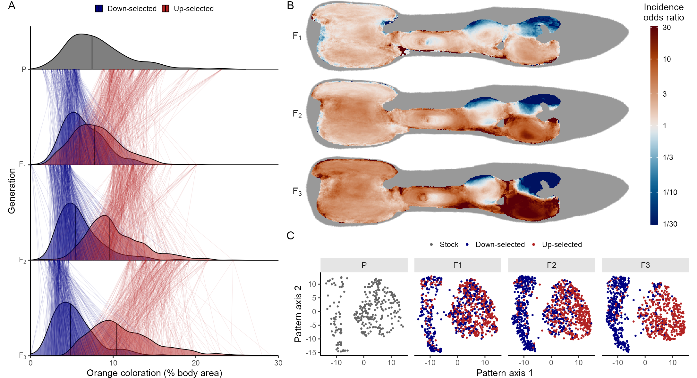

# vdBijl_etal_2024_GuppyColorPatterns

This is the code repository that goes with the following (yet to published) paper:

> Wouter van der Bijl, Jacelyn Shu, Versara S. Goberdhan, Linley Sherin, Maria Cortazar-Chinarro, Alberto Corral-Lopez, Judith E. Mank.
> 
> Deep learning reveals the role of copy number variation in the genetic architecture of a highly polymorphic sexual trait.

Any questions and comments about this repository can be addressed to me, Wouter van der Bijl, wouter[at]mail.ubc.ca.

The vast majority of code in this repository was written in R, with the addition of some bash scripts for bioinformatics on an HPC, and a tiny bit of Stan code.

The code is structured in folder, roughly by the type of analysis:
- `data` contains the (non-image) data sources
- `dimension_reduction` contains the code to learn the pattern space embeddings
- `ornament_analysis` contains the code to assign the ornaments
- `paper_figures` contains the code to reproduce the figures from the main text
- `paper_figures_supplement` contains the supplemental figures, with the code for some of these figures. The others are generated by code in the other directories, together with their associated analayses.
- `phenotyping_pipeline` contains the code to ingest photos and perform semi-automatic phenotyping
- `quant_gen` includes the quantitative analyses of total color and ornaments
- `selection_decisions` contains the scripts used to pick the fish to breed during aritificial selection, and the selection tables.
- `selection_effects` contains analyses on how the selection regime affected color, gross morphology, life history and behavior.
- `sequencing` contains the scripts used for parsing the genetic sequencing data, performing GWAS and subsequent analysis on genomic regions presented in the paper.

Some general comments about names and data that may be useful for re-use:
- Fish are assigned IDs of the form `[sex][replicate]-[running number]`, so that `m1-123` is the 123rd male from replicate 1 and `f3-243` is the 243rd female from replicate 3. These IDs are *not* case-sensitive.
- The generations are often referred to as `parental_gen_1`, `gen_2`, `gen_3` and `gen_4`, which match the P, F1, F2, and F3 generations respectively.
- Most of the code and files refers to orange as "carotenoid" or simply "car", same for black and "melanic" and "mel".
- I needed two attempts at getting black phenotypes with low measurement error. This is why there is sometimes both a `mel` and `mel_v2`. Use the second version.
- Use data loaders when possible, such as `quant_gen/prepare_pedigrees.R`, `selection_decisions/compile_decisions.R`, and the functions and loaders in `sequencing/genomics_helpers.R` and `sequencing/gwas/peak_viz/peak_viz_tools.R`.
 
